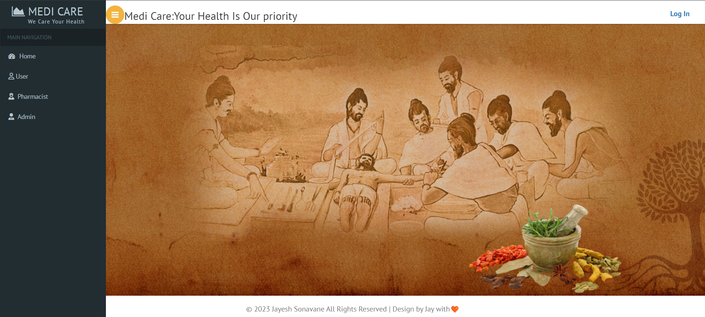

 # Ayurvedic Wellness: Medicine and Remedy Guide. 

An application to find nearby medicines using  Java,MySQL,JSP, Servlet,JDBC,HTML,CSS,JavaScript and XAMPP.

## Table of Contents

 

 

 

 

 

- [Description](#description)
- [Technologies](#technologies)
- [Features](#features)
- [Getting Started](#getting-started)
  - [Prerequisites](#prerequisites)
  - [Installation and Setup](#installation-and-setup)
- [Usage](#usage)
 
- [Contributing](#contributing)
- [License](#license)
- [Contact](#contact)

## Description

The Ayurvedic Wellness: Medicine and Remedy Guider is a comprehensive solution designed to assist users in locating nearby medicines efficiently. This application empowers users to seamlessly search for specific medicines and promptly discover nearby pharmacies and medical facilities where these medicines are available. 

The backend is built on Java and incorporates JavaServer Pages (JSP) for rendering dynamic web pages and Servlets for managing user requests. The application's data is securely stored and managed using MySQL, ensuring efficient retrieval and storage of medicine and pharmacy information.

## Technologies

- MySQL
- Java [version]
- JSP (JavaServer Pages)
- Servlet
- XAMPP
- HTML
- CSS
-JavaScript 

## Features

- **Search Ayurvedic Medicines:** Effortlessly search for specific Ayurvedic medicines and remedies.
- **Nearby Ayurvedic Pharmacies:** Locate nearby pharmacies specializing in Ayurvedic medicines.

- **Effortless Medicine Search:** Users can effortlessly search for specific medicines to verify their availability nearby.
- **Location-based Results:** Leveraging location data, the application offers results relevant to the user's geographical position.
- **Nearby Pharmacies and Facilities:** Users can conveniently access a comprehensive list of nearby pharmacies and medical facilities stocked with the required medicines.
- **User-Centric Interface:** The application's intuitive interface enables easy navigation and quick access to vital information.
- **Customizable Alerts:** Users have the option to set alerts, enabling the application to notify them when nearby pharmacies have the required medicines.

## Getting Started

### Prerequisites

- Java JDK [jdk-8u111-]
- XAMPP [xampp-windows-x64-8.0.25-0]
- Apache tomcaat [apache-tomcat-7.0.82]
- Eclipse

### Installation and Setup

1. Clone the repository.

git clone https://github.com/jayeshsonavane2025/Digital_Medicine_Tracker.git

2. Set up the database using XAMPP.
 

3. Open the project in your Eclipse IDE.
 

## Usage

1. Launch the application.
2. Search for the desired medicine.
3. View a list of nearby pharmacies and medical facilities with the medicine.

 

 

 

## Contributing

Contributions are welcome! To contribute to the project, please follow the guidelines outlined in the [CONTRIBUTING](CONTRIBUTING.md) file.

 

## Contact

Feel free to contact me at mailto:jayeshsonavane2025@gmail.com for any questions, feedback, or collaboration opportunities.

---

 
